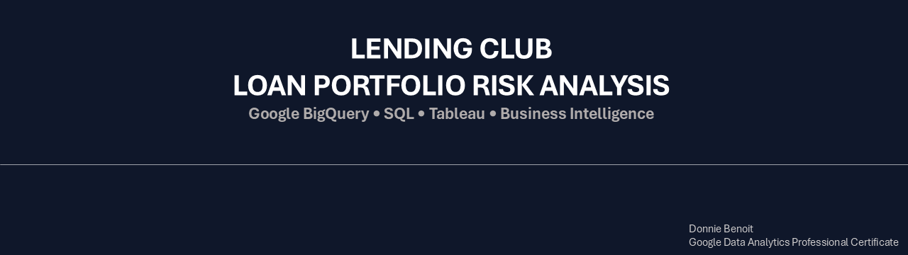
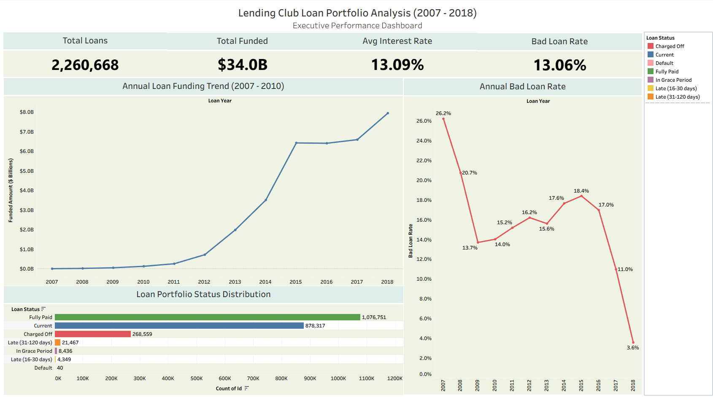
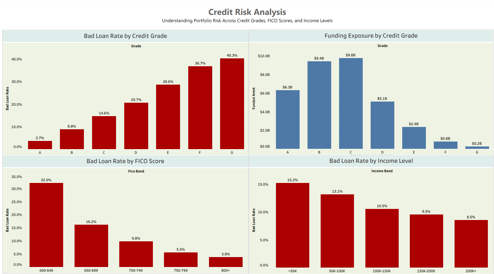
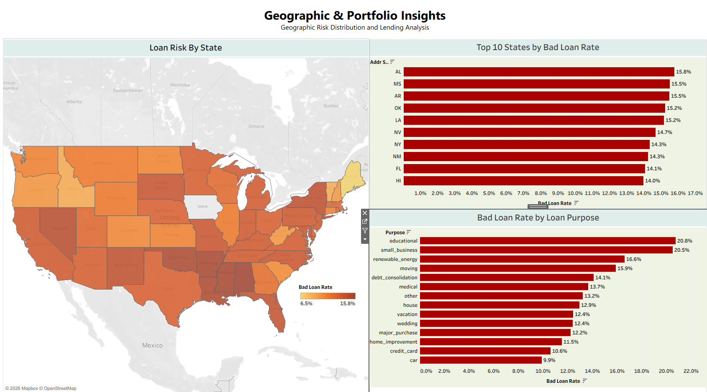

# Lending Club Loan Portfolio Risk Analysis

## End-to-End Data Analytics Project

### Overview

This project analyzes more than **2.26 million Lending Club loans issued between 2007 and 2018** to identify portfolio risk, borrower characteristics associated with loan default, geographic lending trends, and opportunities to improve lending decisions.

Using **Google BigQuery**, **SQL**, and **Tableau**, the analysis follows the complete analytics lifecycle—from data validation and exploratory analysis to executive dashboards and business recommendations.

---

## Business Objective

The objective of this project was to answer the following business questions:

- Which borrower segments present the highest credit risk?
- How effectively do Lending Club credit grades predict loan performance?
- Which FICO score ranges are associated with the highest default rates?
- Are there geographic regions with elevated portfolio risk?
- Which loan purposes contribute the greatest lending exposure?
- What recommendations can improve portfolio performance while balancing growth and risk?

---

## Dataset

| Item | Value |
|------|------:|
| Loan Records | 2,260,668 |
| Time Period | 2007–2018 |
| Variables | 145 |
| Total Funded Amount | $34.0 Billion |
| Platform | Lending Club |

> **Note:** The original Lending Club dataset is not included in this repository due to its size and licensing considerations.

---

## Tools Used

- Google Cloud Storage
- Google BigQuery
- SQL
- Tableau Public
- Microsoft Excel
- Microsoft PowerPoint
---

## Data Preparation

Before analysis, the dataset was validated to ensure the accuracy and reliability of the findings.

The preparation process included:

- Importing the Lending Club dataset into Google Cloud Storage and Google BigQuery
- Validating record counts after import
- Checking for duplicate loan IDs
- Reviewing missing values in critical business fields
- Verifying financial values for consistency
- Creating analytical fields to support reporting, including:
  - Loan Category
  - FICO Score Band
  - Income Band
  - Loan Year
  - Bad Loan Rate

These preparation steps ensured that all subsequent analyses were based on reliable and well-structured data.

---
## SQL Analysis

Google BigQuery SQL was used to answer key business questions and validate portfolio metrics.

Analyses included:

- Executive KPI calculations
- Good Loan vs. Bad Loan classification
- Loan funding trends by year
- Credit grade risk analysis
- FICO score analysis
- Income segmentation
- Geographic portfolio analysis
- Loan purpose analysis
- Portfolio validation and quality checks

The SQL queries were designed to transform raw lending data into business-focused insights that support executive decision-making.

---
## Tableau Dashboards

Three executive dashboards were created to communicate the analytical findings.

### Dashboard 1 – Executive Portfolio Overview

**Business Question:** How has the Lending Club portfolio performed over time?

**Key Insights**

- Portfolio performance summary
- Total funded amount and loan volume
- Good vs. Bad loan distribution
- Annual lending trends

---

### Dashboard 2 – Credit Risk Analysis

**Business Question:** Which borrower characteristics present the greatest credit risk?

**Key Insights**

- Default rates by credit grade
- Portfolio funding exposure
- FICO score analysis
- Income risk segmentation

---

### Dashboard 3 – Geographic & Portfolio Insights

**Business Question:** Where is portfolio risk concentrated, and which loan purposes contribute the greatest risk?

**Key Insights**

- Geographic risk distribution
- Highest-risk states
- Loan purpose analysis
- Regional portfolio exposure
---

# Key Findings

The analysis identified several important patterns across Lending Club's loan portfolio:

- Credit grade is a strong predictor of loan performance, with default rates increasing consistently from Grade A through Grade G.
- FICO score demonstrated a stronger relationship with default risk than borrower income.
- Grade C represents the largest concentration of lending exposure and offers the greatest opportunity to reduce portfolio losses.
- Geographic analysis identified meaningful regional variation in loan performance.
- Debt Consolidation loans account for the largest share of lending volume, while Small Business loans exhibited the highest default rate among major loan categories.

---
# Business Recommendations

Based on the analysis, the following recommendations were developed:

1. Strengthen underwriting standards for higher-risk credit grades.
2. Continue prioritizing FICO score as a primary risk indicator.
3. Monitor Debt Consolidation loans due to their significant portfolio exposure.
4. Incorporate geographic risk into portfolio monitoring.
5. Explore predictive machine learning models to enhance future underwriting decisions.

---
# Skills Demonstrated

- SQL Query Development
- Google BigQuery
- Data Cleaning & Validation
- Exploratory Data Analysis (EDA)
- Feature Engineering
- Tableau Dashboard Development
- Data Visualization
- Business Intelligence
- Executive Reporting
- Data Storytelling

---
# Future Enhancements

Potential future improvements include:

- Predictive machine learning models for loan default probability
- Time-series forecasting
- Interactive cloud dashboards
- Automated reporting pipelines
- Python-based analytics and visualization

---

## Connect With Me

- **LinkedIn:** *(www.linkedin.com/in/donald-benoit-960700413)*
- **Tableau Public:** *(https://public.tableau.com/app/profile/donald.benoit/vizzes)*

Thank you for taking the time to review this project.
